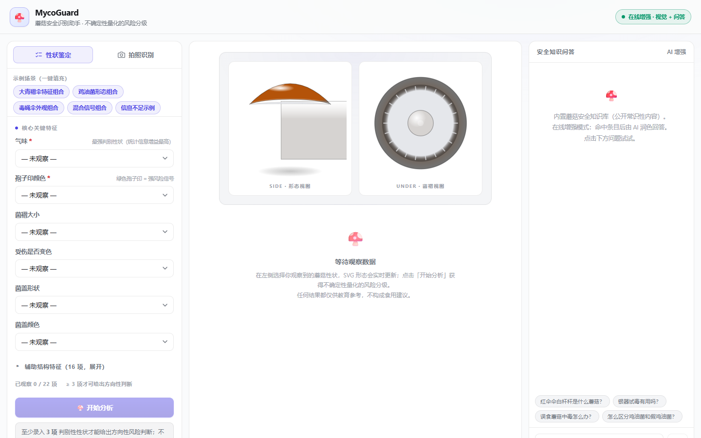
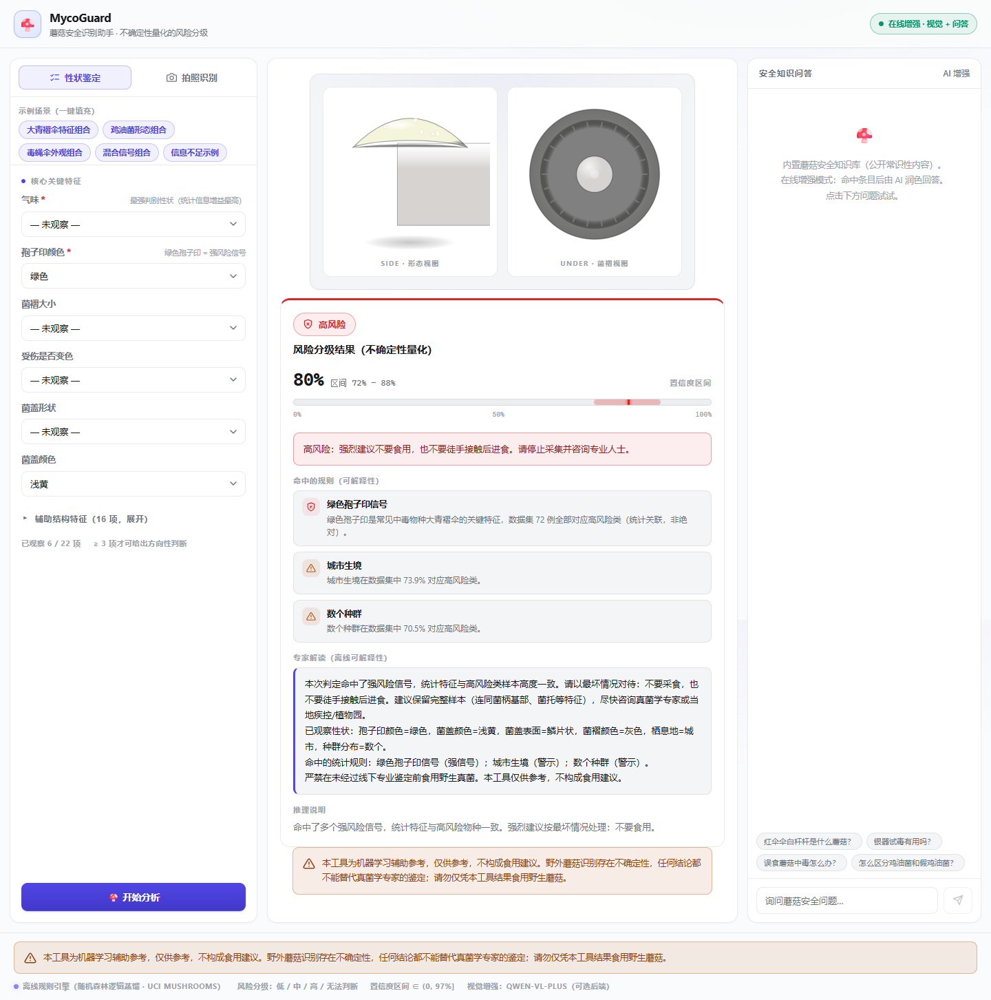
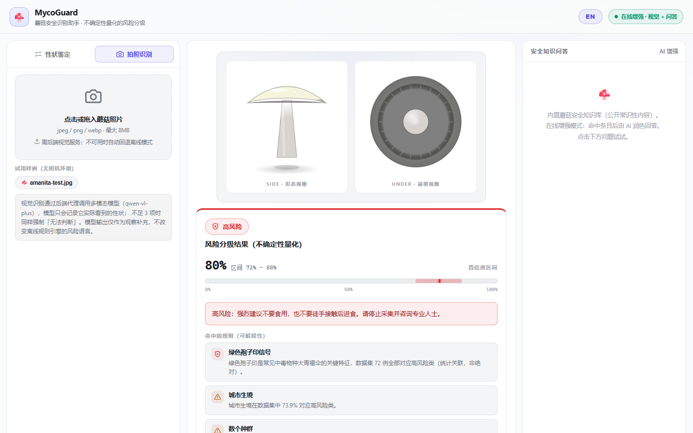
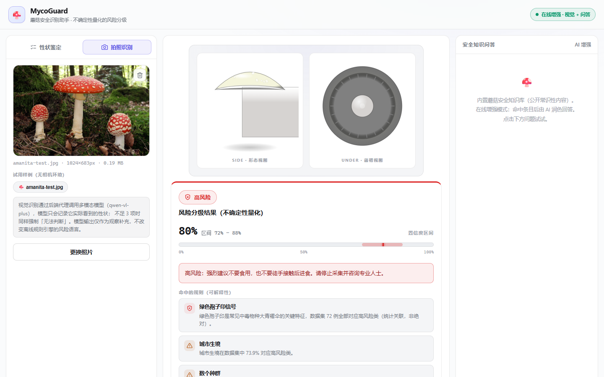

# 🍄 MycoGuard — Mushroom Safety Assistant

**Offline-first, uncertainty-quantified mushroom risk assessment.**

MycoGuard is a production-style, open-source project that turns a course-work
mushroom classifier into a multi-modal safety assistant:

- a **fully offline rule engine** (distilled from the UCI Mushrooms dataset via
  Random Forest analysis) that grades risk into **low / medium / high /
  unknown** — never "edible" / "poisonous";
- **confidence intervals** instead of single-point scores (calibrated to never
  claim certainty, capped at 97%);
- a **photo identification mode** (Qwen-VL, proxied through a tiny FastAPI
  backend) that fills in visual trait observations — and degrades gracefully
  to pure-offline mode when the backend is unavailable;
- a small **safety-knowledge Q&A** (curated public-commonsense entries,
  keyword retrieval, optional DeepSeek fluency enhancement);
- a **prominent disclaimer** on every result page: *for reference only, not
  dietary advice*.

> ⚠️ **DISCLAIMER**: MycoGuard is an educational/engineering project. Its
> output is a statistical risk *indication*, never an identification or
> edibility verdict. Never eat a wild mushroom based on this tool. Consult a
> mycologist or a professional institution.

---

## Why it exists

Wild-mushroom poisoning is a real public-health problem (thousands of cases
and dozens of deaths every year in China alone). Most apps over-claim: a
photo + a confident "safe to eat" verdict is how people get hurt. MycoGuard
takes the opposite stance — **quantify the uncertainty, state the risk level,
and never claim certainty**. The original course project already had a solid
offline rule engine + real-time SVG morphology rendering; this rewrite adds
multi-modal photo analysis, proper uncertainty quantification, a compliant
risk language, a proxy backend, tests, and documentation, so the result is
something you could actually put on GitHub.

---

## Features

| Capability | Where | Notes |
|---|---|---|
| 22-trait manual selector | `src/` frontend | core + advanced groups |
| Real-time SVG morphology renderer | `src/components/MushroomCanvas.tsx` | v5 illustration: gradients/lighting/textures/ring-&-volva, **geometry-guarded** (all trait combos inside the viewBox, ≥8px margin — 294-case vitest + qwen-vl visual review) |
| **Bilingual UI (zh/EN)** | `src/i18n.tsx` | one-click toggle, instant switch; risk tiers, expert narrative, rules, disclaimers, all labels translated |
| Offline rule engine | `src/engine/mushroomEngine.ts` | weights distilled from UCI data |
| Uncertainty grading | engine | low / medium / high / **unknown** (forced when input < 3 traits) |
| Evidence-strength **interval** | engine + UI | `(0, 0.97]`, never 100%, explicitly **not** a safety probability |
| Photo identification | `app/` FastAPI → qwen-vl-plus | base64 proxied; keys never in the browser; **only traits a photo can show** (odor / stalk root rejected) |
| Photo flow UX | frontend | live stages (preparing → analyzing → traits extracted), **"vision" badges** on vision-derived traits, dual-channel pipeline strip, bundled **sample photos** (`samples/`, try without a camera) |
| Offline-first degradation | `src/services/backend.ts` + `/api/health` | manual analysis works with no backend; photo/chat degrade to a clear message |
| Safety-knowledge chat | `app/services/chat.py` | rule-first, optional DeepSeek |
| Tests | vitest (454) + pytest (49) | see [Testing](#testing) |
| Secret hygiene | `scripts/scan_secrets.py` | pre-commit scan; `.env` never committed |

---

## Screenshots






Regenerate with `node scripts/capture_screenshots.mjs` (needs the backend
running and `npm i -D playwright`; uses your installed Edge/Chrome).

---

## Architecture

```
┌─────────────────────────────── Browser (React 19 + TS + Vite) ───────────────────────────────┐
│  Trait selectors ──► SVG renderer ◄── vision traits (gap-filling)                            │
│        │                              ▲                                                      │
│        ▼                              │ evaluateVision(manual ∪ vision)                     │
│  Offline rule engine (risk + confidence interval)  ── same engine for both modes             │
│        │                                                                                     │
│        └──► services/backend.ts  (probe /api/health, upload, chat)  ◄── offline fallback     │
└───────────────┬──────────────────────────────────────────────────────────────────────────────┘
                │ HTTP (no credentials in JS)
┌───────────────▼─────────────────────────── FastAPI proxy (app/) ─────────────────────────────┐
│  GET  /api/health    → {vision, chat} capability probe                                       │
│  POST /api/analyze   → validate + downscale image → qwen-vl-plus (OpenAI-compat) → sanitize  │
│  POST /api/chat      → KB keyword retrieval → optional DeepSeek grounding                    │
│  Keys: env vars or parent projects/.env (BOM-safe parser, redacted repr)                     │
└──────────────────────────────────────────────────────────────────────────────────────────────┘
```

**Offline-first**: the rule engine, SVG renderer, trait selectors, and the
entire analysis UI work with **zero backend** — a fully static page. The
backend only adds photo identification and the safety-knowledge chat; the
chat's "rule mode" (backend running **without** a `DEEPSEEK_API_KEY`) answers
directly from the built-in knowledge base without any LLM call.

---

## Quick start

### 1. Offline mode (frontend only — no keys, no backend)

```bash
npm install
npm run dev          # http://localhost:5173
```

Use the **性状鉴定 (manual traits)** tab. Pick ≥ 3 traits and click
**开始分析**. The status badge shows *纯离线模式 · 规则引擎*.

> Note: manual trait analysis and the SVG renderer work fully offline.
> The **knowledge chat needs the FastAPI backend** (it calls `/api/chat`);
> with the backend down it shows a friendly error. Photo identification needs
> the backend too (see step 2).

### 2. Full stack (photo identification + AI chat)

```bash
# Backend
python -m venv .venv
.venv\Scripts\activate           # Windows  (Linux/macOS: source .venv/bin/activate)
pip install -r requirements.txt  # full toolchain (backend + analysis + tests)
# provide keys via env vars or the parent projects/.env (never committed):
#   DASHSCOPE_API_KEY, DEEPSEEK_API_KEY
.venv\Scripts\python -m uvicorn app.main:app --port 8000

# Frontend (second terminal)
npm install
npm run dev           # vite proxies /api → http://127.0.0.1:8000
```

Production-style single server: `npm run build` then the backend serves the
built `dist/` at `http://localhost:8000`.

---

## API reference

| Method | Path | Body / Params | Returns |
|---|---|---|---|
| `GET` | `/api/health` | — | `{status, version, vision, chat}` |
| `POST` | `/api/analyze` | multipart `file` (jpeg/png/webp ≤ 8 MB) | `{status, species_guess, confidence, traits, notes, warnings}` |
| `POST` | `/api/chat` | `{"question": "..."}` | `{answer, mode: rule\|llm\|fallback, source?, matched}` |

**Contract note (v3, deliberate change).** The response *shape* is unchanged —
same keys, same types — but the domain of two fields is narrower than before:
`traits` can no longer contain `odor` or `stalkRoot` (a photograph cannot
establish either — see "Uncertainty quantification" §6), and `warnings` is now a
live channel (it used to be always `[]`) reporting any non-observable trait the
model claimed and the sanitizer discarded. Both changes are required by the
modality-observability work and are pinned by `app/tests/test_vision_modality.py`
and `src/__tests__/modality.test.ts`.

Errors: `413` too large · `415` not an image · `503` vision not configured
(offline) · `502` upstream LLM failure.

---

## Uncertainty quantification (how the engine thinks)

1. **Four-tier risk language.** Every verdict is one of
   `low / medium / high / unknown`. The words "edible" / "poisonous" never
   appear in engine output (unit-tested).
2. **Forced unknown.** Fewer than **3** traits — or 3+ traits with **no
   discriminative power** — forces `unknown`, even if a dangerous signal was
   observed. Insufficient evidence *is* a safety signal.
3. **Direction and strength are separate.** The risk tier carries the
   *direction*; the number next to it is **evidence strength** — how well
   observed the specimen is — and is labelled as such in the UI (zh + EN). It
   is deliberately **not** a probability that the mushroom is safe.
   `evidenceStrength = 0.5·coverage^1.2 + 0.25·rule-support + 0.15·critical
   + 0.02 − 0.08·(conflicting signals)`, clamped to `(0, 0.97]`, where
   `coverage` is observed traits / 22 — and capped at **0.20 for every verdict
   that is not a `high` finding**, so the fullest evidence bar in the app can
   never belong to the verdict that reads safest. Neither the sign nor the size
   of the risk/safety score difference enters the formula, and a low/medium
   verdict can never look better-evidenced than a high one (verified
   exhaustively over all 8,124 dataset rows in
   `src/__tests__/evalSafety.test.ts`).
   *Fixed in v3: the old point estimate used `Math.abs(Δscore)`, so it grew
   with strongly SAFE evidence too — measured on the pre-fix engine, a 3-trait
   low-risk verdict rendered "54%", a 7-trait anchor set "72%" and a fully
   observed specimen "92%", all painted green with a success check beside a
   0–100% scale.*
4. **Explainability.** Every verdict lists the rules that fired, with
   severity (`info / warning / critical`) and plain-language details, plus a
   deterministic **offline expert narrative** (no API needed) that names the
   observed traits and signals.
5. **Statistical grounding (real numbers).** Weights v2 come from running
   `scripts/analyze_dataset.py` on the actual 8,124-row UCI dataset
   (`distilled_rules.json` is committed), and the engine itself is replayed
   over all 8,124 rows by `npm run eval:safety`
   (`scripts/eval_engine_safety.ts` → `data/raw/engine_safety_report.json`):
   - **The headline number: 0 / 3,916 false-safe.** Of the 3,916 poisonous
     specimens in the dataset, the rule engine graded **none** as low risk —
     and none as `unknown` either. That is the property worth quoting: on this
     dataset the engine never issued a "leans safe" verdict for a poisonous
     mushroom.
   - **Its cost, stated honestly: 370 / 4,208 (8.79%)** edible specimens were
     graded `high` (false alarm), giving **95.45%** binary accuracy. Counting
     `medium` as an alarm too — which is what the UI shows — 71.86% of edible
     specimens get a warning tone at 62.78% accuracy. The engine buys its
     safety with over-warning, not with discrimination.
   - **A one-column baseline beats it on accuracy.** A plain lookup on `odor`
     alone (`c f m p s y` → alarm) scores **98.52%** accuracy with no false
     alarms at all — but misses **120 / 3,916 (3.06%)** poisonous specimens,
     i.e. it has a *worse* false-safe rate. This is the honest trade-off: the
     engine trades accuracy for a zero false-safe rate.
   - **Footnote (near-worthless number):** Random Forest held-out accuracy was
     **100.00%** (test n=1625). This dataset is near-linearly separable, so
     that figure is achieved by essentially any model and carries almost no
     information — it is *not* evidence of field capability, and it is quoted
     here only because the committed `distilled_rules.json` records it.
   - Gini importance top-5: `odor 0.161 · gill-color 0.112 · gill-size 0.111 ·
     spore-print-color 0.093 · ring-type 0.070`.
   - 100%-purity branches: odors `c f m p s y` → poisonous (n=36…2160) and
     `a l` → edible (n=400 each); spore-print `r` → poisonous (n=72);
     gill-color `b` → poisonous (n=1728) / `e o` → edible; ring-type `l` →
     poisonous (n=1296); population `a n` → edible (n=384/400); stalk-root
     `r` → edible (n=192) — each mirrored as a rule with its support count.
   - These are **dataset associations, not biological laws**.
6. **The photo channel only sees what a photo can show.** `odor` (olfaction)
   and `stalk-root` (underground, only exposed by uprooting) are removed from
   the vision model's code table *and* rejected at the sanitizer, because a
   hallucinated "almond odor" is a 6.0-weight critical risk rule and a
   3.5-weight safety anchor at once — enough to push a verdict towards low
   risk. Dropped traits are surfaced in the result page instead of being
   silently ignored. Manual entry is unaffected: a person at the specimen can
   smell it and can dig it up.
7. **Evidence fusion in photo mode may only WIDEN the interval.** The model's
   self-reported confidence is a confidence in a *species guess*, so it is never
   weighted into the risk/evidence number: `gap = |engine.point − model|`
   `< 0.12 → agree (interval unchanged)`, `0.12–0.30 → partial (unchanged)`,
   `> 0.30 → disagree (×1.2, widened; flagged on screen as 区间因双通道分歧加宽)`.
   Widening is the only admissible direction: an optional model answering a
   different question has no authority to make any verdict look *more* precise,
   so agreement is a no-op. A confident model can never rescue an "unknown"
   verdict, never changes the tier, and never moves the point estimate.
8. **One-click example scenarios.** Five teaching presets (大青褶伞 → high,
   鸡油菌形态 → low, 毒蝇伞外观 → unknown, 混合信号 → medium, 信息不足 → unknown)
   fill the trait form in one click — no 22-dropdown barrier for demos.

### Risk levels

| Level | Meaning | Guidance flavor |
|---|---|---|
| `low` | no strong risk signal found — **not** an edible verdict | still *not* a dietary recommendation |
| `medium` | mixed / conflicting signals | add key traits or ask an expert |
| `high` | strong risk signals fired | do **not** eat; treat as worst case |
| `unknown` | insufficient evidence | do **not** eat; gather more data |

A `low` verdict is rendered neutrally (no green success styling, no check
icon) with an explicit "this is evidence strength, not a safety probability"
caveat — see `docs/upgrade-notes.md`.

---

## Testing

```bash
npx vitest run          # frontend (454 tests): engine grading, forced-unknown,
                        # evidence-strength/direction separation, low-verdict
                        # DOM safety (no success styling), modality observability,
                        # UCI safety replay + regression guard, scenarios,
                        # interval fusion, expert narrative, no-absolute-language,
                        # disclaimer presence, constants integrity, backend client
                        # (mocked fetch), presentation helpers
.venv\Scripts\python -m pytest app/tests -q
                        # backend (49 tests): settings/BOM parsing, KB retrieval,
                        # chat rule/llm/fallback, vision parse+sanitize, vision
                        # modality whitelist, API layer with injected fakes
.venv\Scripts\python scripts/scan_secrets.py   # pre-commit credential scan
npm run eval:safety     # replay the engine over all 8,124 UCI rows and print
                        # false-safe / false-alarm / accuracy / odor baseline
```

All LLM calls in tests are mocked (httpx `MockTransport` / injected fakes) —
the suite runs offline and costs nothing.

---

## Project structure

```
mycoguard/
├── app/                      # FastAPI proxy backend
│   ├── main.py               # routes: /api/health /api/analyze /api/chat
│   ├── config.py             # env / parent-.env loading, redacted repr
│   ├── services/
│   │   ├── llm_client.py     # OpenAI-compatible client (transport-injectable)
│   │   ├── vision.py         # image prep + qwen-vl-plus parse/sanitize
│   │   ├── knowledge.py      # keyword retrieval over curated KB
│   │   └── chat.py           # rule-first answer, optional LLM grounding
│   ├── knowledge/entries.py  # 26 curated public-commonsense entries
│   └── tests/                # pytest (49 tests)
├── src/                      # React 19 + TS + Vite frontend
│   ├── engine/               # mushroomEngine.ts, merge.ts (fusion),
│   │                         # scenarios.ts, expert.ts, presentation.ts
│   ├── services/backend.ts   # health probe, upload, chat (offline-safe)
│   ├── components/           # canvas, trait panel, scenario chips, photo
│   │                         # capture, result, chat, disclaimer, icons
│   ├── styles/global.css     # light design system (mobile-ready)
│   └── __tests__/            # vitest (454 tests)
├── samples/                  # bundled demo photos for the "试用样例" button
├── scripts/
│   ├── analyze_dataset.py    # UCI RF distillation (evidence script)
│   ├── eval_engine_safety.ts # UCI safety replay: false-safe / false-alarm /
│   │                         # accuracy / odor baseline  (npm run eval:safety)
│   └── scan_secrets.py       # pre-commit secret scanner
├── data/raw/                 # gitignored: agaricus-lepiota.data + engine_safety_report.json
├── docs/upgrade-notes.md     # the v3 safety upgrade, problem → test → fix → number
├── distilled_rules.json      # generated evidence (committed)
├── .env.example  ·  LICENSE (MIT)  ·  README.md
```

---

## Credits & data sources

- **Dataset**: [UCI Machine Learning Repository — Mushroom
  (agaricus-lepiota)](https://archive.ics.uci.edu/dataset/73/secondary+mushroom+dataset),
  8,124 samples; the Random Forest distillation idea and the original course
  project it upgrades belong to the author.
- **Rule weights**: derived by `scripts/analyze_dataset.py` (RF feature
  importances + 100%-purity branch scan).
- **Knowledge base**: curated from public commonsense guidance — 中国疾控中心
  (China CDC) mushroom-poisoning prevention material, US CDC, North American
  Mycological Association (NAMA), and Wikipedia. Educational summaries only;
  per-entry sources are recorded in `app/knowledge/entries.py`.
- **Models**: [Qwen-VL](https://github.com/QwenLM/Qwen2.5-VL) (阿里云百炼,
  vision) and [DeepSeek](https://github.com/deepseek-ai/DeepSeek-V3) (chat
  fluency), both consumed via OpenAI-compatible endpoints. Keys stay server-side.

---

## 中文摘要

**MycoGuard 蘑菇安全识别助手**：把课程作业（UCI 蘑菇数据集的随机森林分类器）
升级为多模态安全助手。

- **离线优先**：22 性状选择器 + SVG 实时形态渲染 + 规则引擎纯前端离线可用；
  后端只是可选的"在线增强"。
- **不确定性量化**：风险分级为 **低 / 中 / 高 / 无法判断**，证据充分度以**区间**
  展示且永不超过 97%；输入不足 3 项性状时强制「无法判断」；**证据强度与风险方向
  解耦**，低风险档不用绿色成功样式，数字旁明确标注「不是安全概率」。全站与结果页
  均有**免责横幅**（仅供参考，不构成食用建议）。
- **拍照识别**：上传照片 → FastAPI 代理 → **qwen-vl-plus**（OpenAI 兼容格式，
  密钥只留在后端）；后端不可用时自动降级为纯离线模式。
- **安全知识问答**：内置 26 条精编常识知识库（来源逐条标注），关键词检索 +
  可选 DeepSeek 润色，控制规模不做完整 RAG。
- **合规**：删除 Gemini 依赖与"准确率 100%"等绝对化表述；`.env` 不入库；
  `scripts/scan_secrets.py` 提交前扫描密钥；TechSpec/README 已重写为合规版本。
- **数据背书（v3 重新定性）**：`scripts/analyze_dataset.py` 已在真实 UCI 数据集
  （8,124 行）上跑通并提交 `distilled_rules.json`；引擎权重 v2 按真实数据校准
  （修复了原引擎 gill-color / ring-type 零权重缺口）。**真正的安全指标**由
  `npm run eval:safety` 用真引擎回放全部 8,124 行得出：
  **3,916 行有毒样本中判为低风险 0 行（假安全率 0/3916）**，代价是 8.79% 假警报
  （370/4208 可食样本被判高风险）、二分类准确率 95.45%；若把「中风险」也算作警报，
  则 71.86% 的可食样本会被示警。对照单性状 `odor` 查表基线：准确率 98.52% 更高、
  假警报 0%，但会漏掉 120/3916（3.06%）有毒样本——即假安全率更差。这就是本项目
  的取舍：**用准确率换零假安全**。随机森林留出集 100% 已降级为附注（该数据集近线性
  可分，此数字几乎无信息量，不构成野外能力证据）。
- **不确定性的正确语义（v3）**：结果页那个数字已从"置信度"改为**证据充分度**——
  风险档位表达方向，数字只表达证据强弱与区间宽度，UI 明确标注它不是安全概率；
  低风险档**不再**使用绿色对勾/成功样式（改中性色 + "未发现强风险信号"）；视觉模型
  自评（物种置信度）不再加权进风险数字，只调整区间宽度。原实现用 `Math.abs(Δscore)`
  导致风险越低数字越高（3 性状低风险 54%、7 性状锚点组合 72%、22 性状全观察 92%），
- **模态可观测性（v3）**：`odor`（气味）与 `stalkRoot`（地下菌柄根部）无法从照片
  观察，已从视觉提示词代码表与 `_sanitize` 白名单中移除，合并层再做一次丢弃拦截；
  被丢弃的性状会在结果页显式提示。手工录入不受影响（人站在标本前可以闻、可以挖）。
- **易用性**：5 个一键示例场景（大青褶伞→高、鸡油菌形态→低、毒蝇伞外观→无法
  判断、混合信号→中、信息不足→无法判断）；拍照模式置信度融合（视觉 model
  confidence 参与最终区间 + 双通道一致性指示）；离线结果页提供确定性"专家解读"
  （严格不弱于原版 Gemini 解释文本）。
- **演示强化（v5）**：SVG 蘑菇渲染升级为"产品级插画"（渐变光影、菌盖鳞片/凹槽/
  纤维/高光纹理、菌环与菌托结构、400ms 过渡动画），并修复菌柄越界 bug（几何
  校验 294 组合全绿 + qwen-vl 视觉审查确认"菌柄完整、构图自然"）；拍照识别
  展示完整过程状态（上传中 → 视觉分析中 → 性状已提取）、结果页展示分析所用照片
  （点击放大/灯箱）、表单"vision"徽章标记视觉来源性状、双通道链路图；`samples/`
  内置样例照片一键体验。
- **中英双语（v5）**：右上角 EN / 中文 一键切换、即时生效；风险分级、专家解读、
  规则文案、免责声明与全部界面标签均已双语化（字典 `src/i18n.tsx`）。
- **测试**：vitest 454 项 + pytest 49 项（LLM 全部 mock，离线可跑）；其中包含
  用真实 UCI 数据回放引擎的安全回归护栏（假安全数必须为 0，指标退化即变红）。

**快速开始**：`npm install && npm run dev`（纯离线）；后端
`pip install -r app/requirements.txt && uvicorn app.main:app --port 8000`，
配好 `DASHSCOPE_API_KEY` / `DEEPSEEK_API_KEY` 即启用拍照识别与 AI 问答。

---

## Known limitations

- **Dataset bias.** The UCI Mushrooms dataset is a curated teaching set
  (poisonous/edible roughly balanced) — it does **not** reflect real-world
  species distributions or local flora. Its held-out accuracy is ~100% for
  essentially any model, which is why it is a footnote here and not a claim.
- **Weights encode dataset statistics, not mycology.** Rules like "buff gill
  color → high risk" come from purity branches in this dataset; a real
  mushroom may differ. Every verdict is a statistical prior, not evidence.
- **The 0/3,916 false-safe rate is a replay property, not field validation.**
  It was measured by re-grading the same UCI rows the weights were distilled
  from, so it is in-sample by construction and cannot be extrapolated to a
  real forest. It shows the engine's *logic* never issues a "leans safe"
  verdict on that data — nothing more.
- **Vision is observational, not forensic.** qwen-vl-plus can only be asked
  about traits a photo can show (odor and stalk root are rejected at the
  sanitizer); it cannot reliably distinguish look-alike species, and a bad
  photo yields `unknown` (by design).
- **No field validation.** The distilled weights were not re-validated on
  independent field samples.
- **KB is educational-scale.** The knowledge base is a curated handful of
  entries (keyword retrieval, not full RAG) — fine for FAQ-style safety
  questions, not a mycological reference.
- **Chat LLM is optional.** Without `DEEPSEEK_API_KEY`, chat answers from the
  knowledge base directly (rule mode).

## License

[MIT](./LICENSE). MycoGuard is an educational project — see the disclaimer
above; it is **not** a foraging or medical tool.
